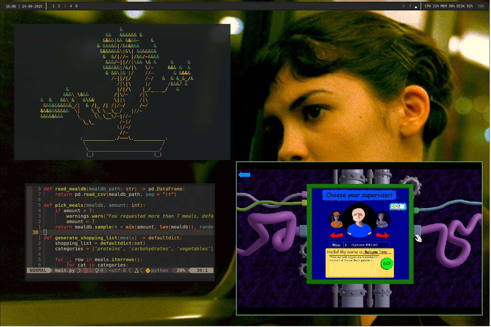
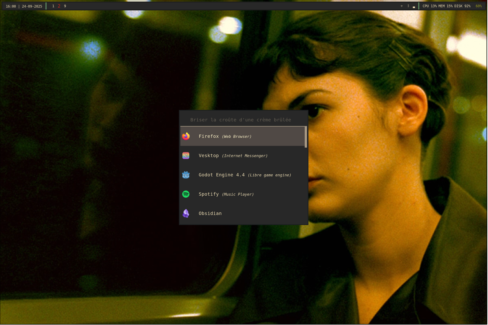
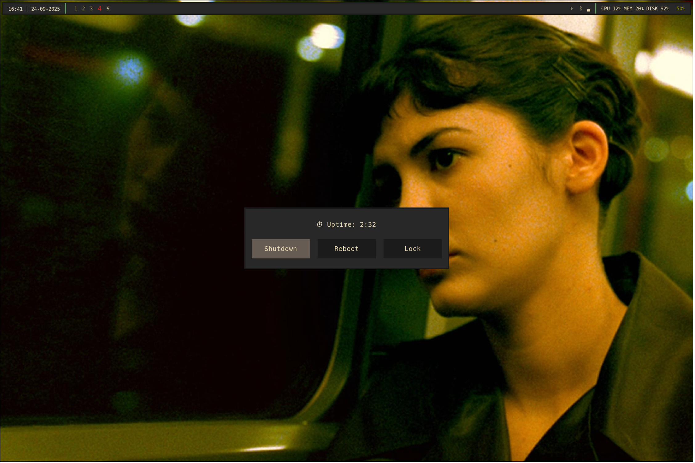

<div align="center">
    <h1 align="center">My NixOS configuration</h1>
    <p align="center">
        Simple NixOS setup with Hyprland
    </p>
</div>

</br>

## About The Project

This configuration is focused on having only the essential visual and practical elements. It focuses on productivity; Python development, Godot game development, Obsidian for notetaking, Gimp for art, ...

</br>

## File setup
Files are divided by their main function, so that editing this main function immediately gives an overview of all settings etc. related to that function.

Nixvim and Home are modules.

## Flake & Home-Manager
This is a flake setup where the packages pin pointed to ensure reproducibility. The `flake.nix` file defines inputs (dependencies like repositories for home-manager and nixvim), outputs (packages that can be build, and nixosConfiguration).

> Rebuild a flake
> -
> To rebuild a flake use: `sudo nixos-rebuild switch --flake .#my-host`

The home-manager is used as a NixOS module, which means it rebuilds when the flake is rebuilt (no ability to do`home-manager rebuild`). It's a simple setup where home-manager is treated like any other NixOS module, and it is able to configure users (like the flake user) inside the NixOS configuration or even directly in the flake.

The `home.nix` file defines the user's configuration (programs, dotfiles, etc.). Currently in this setup no config files are being managed by home-manager yet, but this will soon follow so all the configs of my programs can be shared across hosts.

> Transfer dotfiles to Home Manager
> -
> For example how to transfer the Zathura config to home-manager:
> ```nix
> xdg.configFile."zathura/zathurarc".source = ./dotfiles/zathurarc;
> ```
> By having a `dotfiles` folder in the `home` folder where all the dotfiles, including the Zathura one, will be kept.
>
> Alternative approach is to do it in nix language, import in `home.nix`, and replace the text: 
> ```nix
> xdg.configFile."zathura/zathurarc".text = ''
>   set font "monospace 12"
>   set recolor true
>   set recolor-keephue true
>   set adjust-open width
>   set statusbar-h-padding 10
>   set statusbar-v-padding 5
> '';
> ```

</br>

## Dotfiles
Current main minimal NixOS Linux setup with Hyprland. Configuration with (mostly) Gruvbox Dark and a _Le Fabuleux Destin d'Amélie Poulain_ theme. Only the essential visuals are set up in terms of Waybar, Hyprland and color scheming. Minimal apps are installed to focus on productivity, with a balance of relaxing games via Steam.

### Main visual


<details>
    <summary>Other visuals</summary>




</details>

### Desktop resume
| *Category*         | *Application* |
| ------------------ | ------------- |
| Compositor         | Hyprland      |
| Terminal Emulator  | Kitty         |
| Shell              | Bash          |
| Editor             | Neovim        |
| Menu               | Rofi-wayland  |
| Bar                | Waybar        |
| Network            | nmtui         |
| Bluetooth          | Bluetoothctl  |
| Brightness         | Brightnessctl |
| Sound              | Pulse Audio   |
| PDF reader         | Zathura       |
| Terminal Animation | cbonsai       |
| Music Player       | Spotify       |
| Notes              | Obsidian      |
| Games              | Steam         |
| Webbrowser         | FireFox       |
| Game Engine        | Godot         |
| Media Player       | mpv           |
| Image Editor       | GIMP          |
